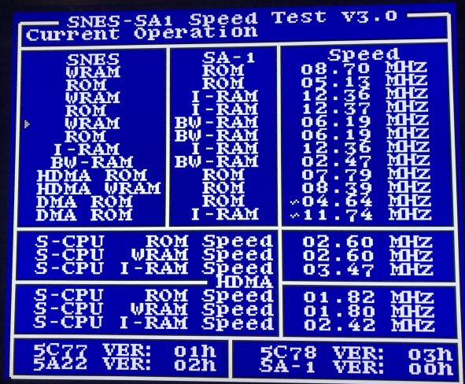

# SNES Speed Test

SNES Speed Test, SA-1 Speed Test or just Speed Test is a homebrew ROM for measuring
the CPU speed of SA-1 CPU and SNES CPU under certain conditions. It assumes a NTSC
frequency and calculates the clock speed based on how many operations made between
two V-Blanks.

Features:
 * SA-1 speed measuring
 * High accuracy
 * Testing against many devices operation (ROM, I-RAM, BW-RAM, WRAM)
 * Testing while running DMA and H-DMA in parallel.
 * Error handling for faulty cases during tests.
 * Measures up to ~60 MHz, for overclock testing.
 * Display version number of PPU1, PPU2, S-CPU and SA-1.
 
## Expected Values
What are the expected speed values?

### SA-1 Speed Test
SNES Operation | SA-1 Operation | SA-1 Speed
---------------|----------------|------------
WRAM|ROM|10.06 MHz (note 1)
ROM|ROM|~5.43 MHz (note 2)
WRAM|I-RAM|10.74 MHz (note 3)
ROM|I-RAM|10.74 MHz (note 3)
WRAM|BW-RAM|5.37 MHz
ROM|BW-RAM|5.37 MHz
I-RAM|I-RAM|~3.74 MHz (note 4)
BW-RAM|BW-RAM|~2.68 MHz (note 5)
HDMA ROM|ROM|~8.53 MHz
HDMA WRAM|ROM|10.74 MHz
DMA ROM|ROM|~5.37 MHz (note 2)
DMA ROM|I-RAM|~10.74 MHz

Note 1: While expected to be 10.74 MHz, the jump/branch opcodes (including the JMP addr
used for the test) takes an additional internal cycle which is not expected by the test,
hence the slight lower clock speed. The hardware is actually running at 10.74 MHz.

Note 2: It's believed that the SA-1 ROM access is actually 5.37 MHz with a 16-bit bus.
Since two values are accessed at once, the effective speed end up being 10.74 MHz, however
with a cost of the jump and certain branch operations taking one additional cycle, which
justifies the behavior from note 1. However, that also means when the S-CPU accesses the
game ROM, it will use a whole 5.37 MHz cycle, meaning that the SA-1 CPU will only have
a single 5.37 MHz cycle per time. In practice, parallel accesses by both CPUs will clock
down the SA-1 CPU to 5.37 MHz, even if the SNES only does an access every 8 master cycles
and SA-1 every 2 master cycles. A single S-CPU access will take 4 master cycles from ROM
and the same from SA-1. However, internal SA-1 cycles are still 10.74 MHz.

Note 3: Hardware tests reported 9.92 MHz. Current theory is that happens due of the SNES
CPU occasionally checking the I-RAM during the wait loop. See also note 4.

Note 4: It's not really documented on the official SNES dev. book that I-RAM include wait
cycles as well when both CPUs accesses it. Probably a constant access from the SNES CPU
will imply into a 3.58 MHz access from the SA-1 CPU. The only logical reason for that
is because the S-CPU has "FastROM" access to the I-RAM, so the SA-1 system must priorize
and grant S-CPU read/write permission at 3.58 MHz, which implies into more wait time for
the SA-1 CPU than normal (compared to the 5.37 MHz access via ROM, for example).

Note 5: It's likely that BW-RAM has the 16-bit bus as well and accessing SNES and SA-1
at the same time will make both chips accesses it at 2.68 MHz.

### SNES Speed Test

SNES Operation | HDMA | SNES Speed
---------------|------|------------
ROM|No|2.60 MHz
WRAM|No|2.60 MHz
I-RAM|No|3.47 MHz
ROM|Yes|1.82 MHz
WRAM|Yes|1.82 MHz
I-RAM|Yes|2.42 MHz

The WRAM refreshes (~40 master cycles per scanline) is what makes the bus speed don't
reach the nominal 2.68/3.58 MHz. The HDMA tests involves eight indirect data HDMA
channels in parallel, for every frame.
 
## Current Results

### Real hardware
More can be found [here](img/hardware), including advanced pages and videos.

#### 1L8B-10
Thanks QcRetro for the picture and testing on hardware.

#### 1L3B-20
Thanks ikari_01 for the picture and testing on hardware.

### bsnes
Version: v106r44

### sd2snes
Version: 1.8.0 + RedGuy SA-1 v06 -- picture by terminator2k2

### Snes9x
Version: 1.56.2

More versions can be found [here](img/snes9x).

### ZSNES
Version: 1.51

More versions can be found [here](img/zsnes).

### no$sns
Version: 1.6

### Snes9x for 3DS
Version: 1.30 -- picture by LX5.

